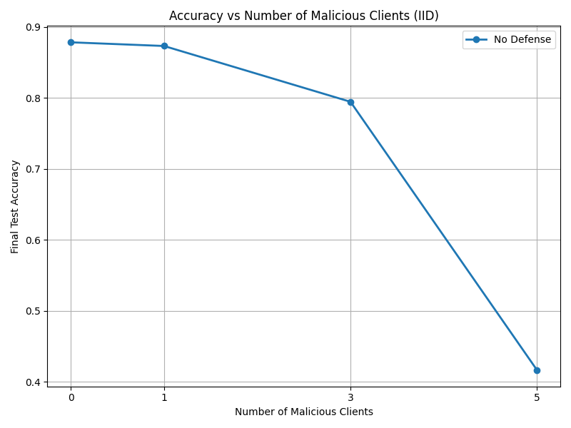
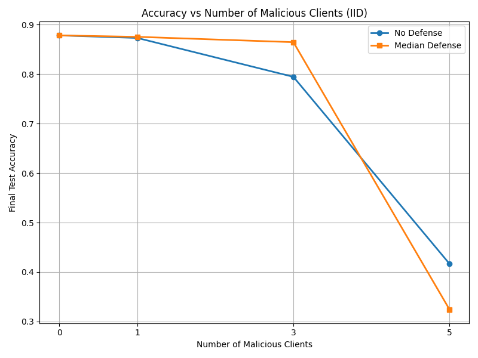
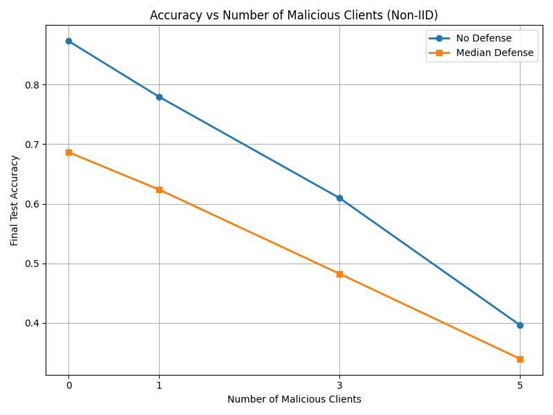

# Fourth Lab Report — Federated Learning & Data Privacy
Université Côte d’Azur – MSc Data Science & Artificial Intelligence  
Author: Zeev Weizmann  
November 2025

---

## Overview
This project investigates label‑flipping attacks in Federated Learning and evaluates the robustness of FedAvg and coordinate‑wise median aggregation under both IID and non‑IID data distributions.  
Experiments include malicious client simulation, robust aggregation, and performance comparison.

---

## Visual Results

### IID — No Defense  


### IID — Median Defense  


### Non‑IID — With and Without Defense  


---

## Exercise 1 — Label‑Flipping Attacks

### Data Generation
```bash
rm -r mnist/all_data
python generate_data.py   --dataset mnist   --n_clients 10   --iid   --frac 0.1   --save_dir mnist   --seed 1234
```

### Malicious Learner
A custom learner flips labels by +1 (mod 10):
```python
y = (y + 1) % 10
```

### Running Experiments
```bash
for p in 0 0.1 0.3 0.5; do
python train.py   --experiment mnist   --n_rounds 25   --prop $p   --n_clients 10 ...
done
```

### Findings
- 0–10% malicious clients: model remains stable.  
- 30%: noticeable degradation.  
- 50%: the global model collapses.

FedAvg is highly vulnerable to label‑flipping attacks.

---

## Exercise 2 — Median Defense

### Median Aggregator
Coordinate‑wise median is used:
```python
median_state[k] = torch.median(stacked, dim=0).values
```

### Findings
- Works well up to 30% malicious clients.  
- Fails when attackers reach 50% because the median gets dominated by adversarial updates.

Median is effective only when honest clients form a coherent majority.

---

## Exercise 3 — Non‑IID Case

### Findings
Median becomes worse than FedAvg under non‑IID:
- Honest clients produce heterogeneous updates.  
- Median treats legitimate differences as noise.  
- The global model under‑trains and accuracy drops quickly.

FedAvg tolerates gradient heterogeneity better and therefore performs higher in the non‑IID setting.

---

## Links
Repository SSH clone: `git@github.com:ZeevWeizmann/fedcourse24_lab4.git`  
Repository HTTPS: https://github.com/ZeevWeizmann/fedcourse24_lab4  
Project website: https://zeevweizmann.github.io/fedcourse24_lab4/  
PDF report: https://github.com/ZeevWeizmann/fedcourse24_lab4/blob/7921d96790bb66a5dba7b8a1bb147a7b4f46842c/Lab_Report%20(1).pdf
